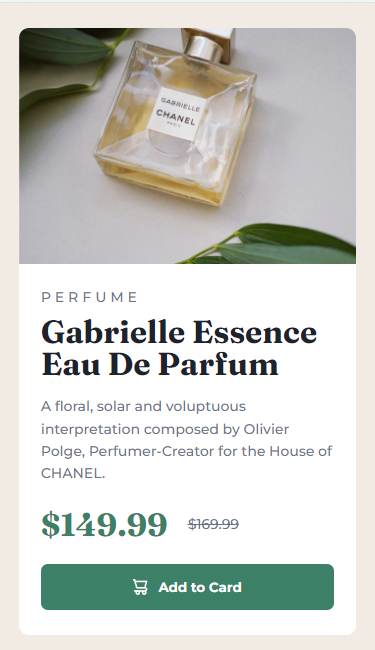
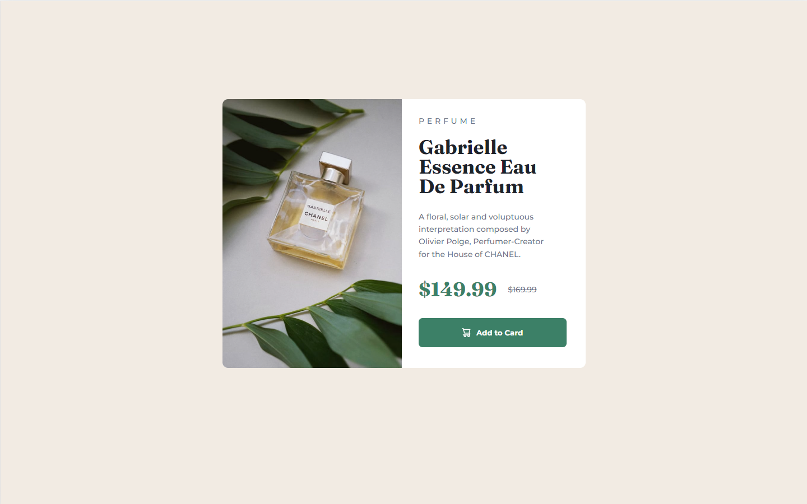
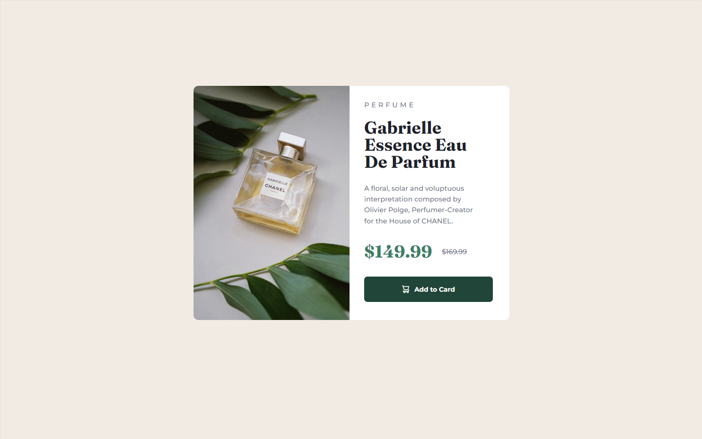

# Frontend Mentor - Product preview card component solution

Hello and welcome! Thank you for stopping by.🤠

This is my solution to the [Product preview card component challenge on Frontend Mentor](https://www.frontendmentor.io/challenges/product-preview-card-component-GO7UmttRfa). Frontend Mentor challenges help you improve your coding skills by building realistic projects and I would like to thank to all team of FEM.🙏

## Table of contents

- [Overview](#overview)
  - [The challenge](#the-challenge)
  - [Screenshot](#screenshot)
  - [Links](#links)
- [My process](#my-process)
  - [Built with](#built-with)
  - [What I learned](#what-i-learned)
  - [Continued development](#continued-development)
  - [Useful resources](#useful-resources)
- [Author](#author)
- [Acknowledgments](#acknowledgments)

## Overview

### The challenge

In this document you should be able to:

- View the optimal layout depending on their device's screen size
- See hover and focus states for interactive elements

### Screenshot

Width: 375px


Width: 1440px


State: Active


### Links

- Solution URL: [GitHub Repository](https://github.com/PetrValenta92/product-preview-card)
- Live Site URL: [GitHub Pages](https://petrvalenta92.github.io/product-preview-card/)

## My process

### Built with

- Semantic HTML5 markup
- CSS custom properties
- Mobile-first workflow
- Responsive images
- Flexbox
- Media quary

### What I learned

In this section I recap over some of your major learnings while working through this project.

Responsive images:

```html
<picture>
  <source
    media="(min-width: 900px)"
    srcset="./images/image-product-desktop.jpg"
  />
  
</picture>
```

Link Google fonts:

```html
<link
  href="https://fonts.googleapis.com/css2?family=Fraunces:opsz,wght@9..144,700&family=Montserrat:wght@500;700&display=swap"
  rel="stylesheet"
/>
```

Custom properties:

```css
:root {
  --dark-cyan: hsl(158, 36%, 37%);
  --cream: hsl(30, 38%, 92%);
  --very-dark-blue: hsl(212, 21%, 14%);
  --dark-grayish-blue: hsl(228, 12%, 48%);
}
```

### Continued development

In the near future I would like to continue working on another FEM challenges. I still have a room for improvement in my HTML and CSS skills. For example GRID, animations... Than I am going to add JavaScript into my projects and create my first web-app.

### Useful resources

- [W3Schools](https://www.w3schools.com/) - This page/project helped me a lot when I did not know a CSS property or when to use a proper HTML element.

## Author

- Website - [_to be added_]()
- GitHub - [@PetrValenta92](https://github.com/PetrValenta92)
- Frontend Mentor - [@PetrValenta92](https://www.frontendmentor.io/profile/PetrValenta92)
- Instagram - [@petr.codes](https://www.instagram.com/petr.codes/)
- LinkedIn - [@valentapetr](https://www.linkedin.com/in/valentapetr/)

## Acknowledgments

I would love to thank whole FEM team for such amazing project they have created. Also I want to thank the [Junior Guru Community](https://junior.guru/) ❤
